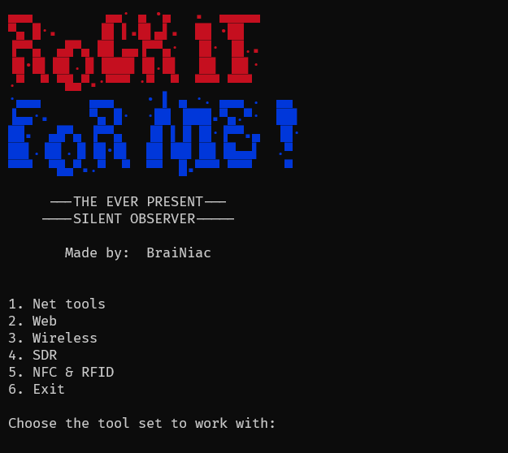

#  Rock it for me!

Rock it for me is a framework made for Cybersecurity professionals with the
intent of simplifying daily work operations.<br>

<b><span style="color:red;">Rock it </span></b>
<b><span style="color:blue;">For me</span> toolset currently packs</b>:

- Networking tools;
- Wireless tools;
- Web tools;
- SDR (Software defined radio) tools;
- NFC & RFID (Contactless) tools

and more to come soon.


<br>

## 🚀 Run

You can run the Go script in all operational systems with:

```
go run main.go
```
or you can:
```
go build .    in the project root, and it will compile the executable for you.
```
In case you compiled the binary, you can just:

```
./rockitforme
```

---
### 📋 Prerequisites

- Golang 1.22+
---
### 📋 Compatibility & Considerations

- Currently ROCK IT FOR ME is mostly compatible with linux systems;
- Rooted android devices perform really well, speacially with NET HUNTER installed;
- Some tools are able to run on Windows systems already;
---
### 🔧 Installation

- Golang 1.22+ --> [Official download page](https://go.dev/doc/install);
- libpcap;

Installing libpcap:
#### Fedora
```bash
sudo dnf install libpcap-devel
```
#### Ubuntu / Debian
```bash
sudo apt install libpcap-dev
```
#### Arch
```bash
sudo pacman -S libpcap
```
#### Windows
*coming soon...*
#### Mac OS
*coming soon...*
#### Android devices (Root required)
*coming soon...*

---

## 🚧 Next upcoming upgrades


<b>1.</b> Dependency auto installer module upgrade:<br>
[<b><span style="color:green;">+</span></b>] Will also include <b>Golang</b> and <b>libpcap</b>;

<b>2.</b> Stabilize Cross compatibility expansion:<br>
[<b><span style="color:green;">+</span></b>] Included operating sytems:
- <b>Fedora</b>;
- <b>Debian</b>;
- <b>Ubuntu</b>;
- <b>Arch</b>;
- <b>Windows</b>;
- <b>Mac OS</b>;
- <b>Android devices</b> (Root required)

<b>3. </b>Integration with new powerful tools:<br>
[<b><span style="color:green;">+</span></b>] Sit tight and enjoy the ride 🔨👷

---
## 📝 Credits, mentions, inspirations

This framework is dedicated to the Security community, as it was and remains being the source
of my inspiration to maintain following the path and also fight for what I've always desired.

In This swiss army knife framework you will find a great deal of tools that keep me in company and
I believe it always will for my entire life.

It also contains tools I designed, and will have more of them.

When the first stable release comes I will leave here all my inspirations for this project.

⌨️ Made with ❤️ by [BraiNiac](https://github.com/babyboydaprince) 👽