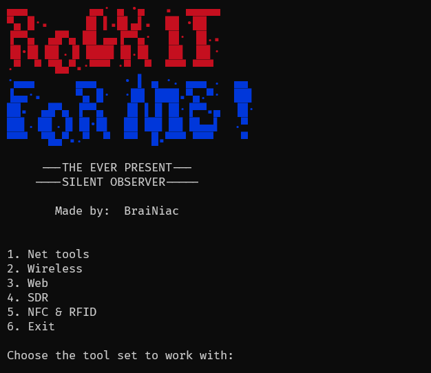

#  Rock it for me!

Rock it for me is a framework made for cybersecurity professionals with the
intent of simplifying daily work operations.<br>

Containing Wireless pentesting tools, Network tools, Web pentesting tools
and more to come soon.



## 🚀 Run

You can run the Go script in all operational systems with:

 ```
go run main.go
```

### 📋 Prerequisites

- Golang 1.20+

### 🔧 Installation

```
Running the executables or the Go script it will install the 
dependencies automatically.
```

## 🛠️ Made with

- Golang 1.21

## 📌Go change my mac version

- 1.0

---

## 📄 Terms

I, the developer, do not take any responsibility charges for bad usage
of this software.

This tool was created for study purposes.

Respect other people's privacy.

---

## 📌 Comming soon

- Windows interface enabler and disabler complete functionality;
- Wireless pentesting tools;
- Web pentesting tools;
- SDR tools;
- Network analysis;
- And much more...

---

⌨️ Made with ❤️ by [BraiNiac](https://github.com/babyboydaprince) 👽

